# Java BigData 2024
## 1 일차
### 파이썬 개발환경 설정
> - [Git](https://git-scm.com/) 세팅 및 [GitHub](https://github.com/) 가입
> - [Github Desktop](https://desktop.github.com/?ref_cta=download+desktop&ref_loc=installing+github+desktop&ref_page=docs) 설치 및 세팅
> - [Python](https://www.python.org/) 설치
> - [VS code](https://code.visualstudio.com/) 설치
> - [D2coding](https://github.com/naver/d2codingfont) 폰트 세팅
### Python 학습 
> 1.  Python 개요
> 2. Python 기초 문법 : 기본 자료형 , 문자열 자료형 , 리스트 , 튜플

#### 기본 자료형
- <span style="color:olivedrab">_타입을 적지 않아도 값에 따라 타입이 정해진다._</span>
    ```python
    a = 3 # 정수형
    b = 3.14 # 실수형
    ```
#### 문자열 자료형
- `""`(쌍따옴표) or `''`(홀따옴표) 구분없이 문자열을 감쌀 수 있다.
- 인덱싱은 `[위치값]` 으로 접근 가능하지만 문자열 수정은 안된다 !!
    - `list[0]`
- 슬라이싱은 `변수명[시작위치:끝위치]` 를 이용하여 짤라서 출력한다.(-를 붙히면 뒤에서 부터 카운팅)
- `format()` 함수를 사용하면 포맷팅이 가능하다.
    ```python
    temp = 21
    print("현재 온도는 %d도 입니다." % temp)
    ```
- python 3.6 부터는 `f 포맷팅`이 가능하다.
    ```python
    ## f 포맷팅 ( Python 3.6 이상 지원 )
    name = "Cristiano"
    age = 37

    cont = f"나는 {name}이고, 나이는 {age}세 입니다."
    print(cont)
    ```
- 문자열 함수는 `count()` , `find()` , `index()` , `join()` , `lower()` , `upper()` 등등이 있다.
    - <span style="color:indianred">***외우지 말고 한 번 눈으로 훑고 필요할 때마다 찾아쓰면 된다.***</span>
#### 리스트와 튜플
- 리스트는 다른 프로그래밍 언어의 배열과 같다 !!
    - `list = [1,4,5]`
    - `list = [1,"hi",True,None]` : <span style="color:slateblue">_꼭 같은 타입의 원소로 이루어져 있지 않아도 된다 !!_</span>
- 인덱싱과 슬라이싱은 문자열과 똑같이 사용하면 된다.
- *2차원 배열*은 [] 안에 [] 를 넣어주면 된다. 즉, <span style="color:olivedrab">_리스트안에 리스트를 넣는 것이다_</span>
    ```python
    ## 2차원 리스트
    d2Datas = [[1, 2, 3, 4], [5, 6, 7, 8], [9, 10, 11, 12]]
    print(d2Datas)
    ```
- 리스트의 함수는 아래와 같다.
    - `append(value)` : 리스트 맨 뒤에 원소 추가
    - `insert(index, value)` : 특정 위치에 값을 추가
    - `sort()` : 오름차순
    - `sort(reverse=True)` : 내림차순
    - `reverse()` : 역순
    - `count()` : 단어 갯수
    - `index()` : 단어 위치 반환
    - `remove(value)` : value 1개만 삭제
    - `pop()` : <span style="color:slateblue">_맨 마지막 원소 출력 후 삭제_</span>
- <span style="color:indianred">***튜플은 리스트와 똑같다. 하지만 수정,삭제가 안된다 !!***</span>

## 2일차
### Python 학습
> 1. 딕셔너리 집합
> 2. 불(bool)형
> 3. None형
> 4. 제어문(if , for , while)
> 5. 제어문 연습
> 6. 함수

#### 딕셔너리
- Key 와 Value 가 한 쌍으로 이루어진 자료형
    ```python
    spiderMan = {
        "name": "Cristiano Ronaldo",
        "age": 37,
        "weapon": "Body",
        "friends": ["Messi", "Neymar", "Park"],
    }
    ```
- `items()` : 모든 아이템 출력
- `get(key)` : 딕셔너리 Value 가져오기
- `clear()` : 데이터 모두 삭제
- `del` : 객체 자체를 삭제
#### 불(bool)형과 특수타입(None)
- Python 에서 bool 타입은 **참/거짓을 판별하는 자료형**이다.
- 다른 프로그래밍 언어와 다르게 `True / False` 로 구분된다.
- `None` 은 `Null` 과 똑같은 의미를 가진다.
#### 제어문
- if문
    ```python
    if money == True:
        # indentation(들여쓰기) : 파이썬에서 들여쓰기르 잘 못하면 에러가 뜬다.
        print("택시타고 가")
    elif money < 5000 and money >= 2500:  # Python 에서 else 는 elif 로 쓴다.
        print("중간에 내릴게요")
    else:
        print("뛰어가")
    ```
- for문 : `range()` 함수를 자주 쓴다.
    - range(시작값, 끝값, 증감값) 이 기본이며 시작값과 증감값을 생략하면 0부터 시작해서 1씩 증가한다.
    ```python
    grade = [90, 80, 50, 70, 10]
    sum = 0
    for i in grade:
        sum += i
    ```
- `list comprehension` : 여러 조건으로 list 를 대량으로 생성할 떄 유용
    ```python
    print([i for i in range(1, 10001)])

    print([num * 3 for num in range(1, 1001) if num % 3 == 0])
    ```
#### function(함수)
- 반환타입 없이 `def` 키워드를 사용하여 선언
- 동적 매개변수
    ```python
    def plus_many(*items):  # 동적 매개변수
        result = 0
        for item in items:
            result += item

        return result
    ```
- `람다(lambda)`함수
    ```python
    add = lambda a, b: a + b
    print(add(5, 4))

    madd = lambda a, *args: [i * 4 for i in args]
    print(madd(3, 1, 2, 4))
    ```
## 3일차
### Python 학습
> 1. 사용자 입출력
> 2. 객체지향

#### 데이터 입력
- `input()` 함수를 호출하면 콘솔창에서 입력을 받을 수 있다..
- `input()` 함수로 **받는 입력값은 str타입**이다.
- 만약 _한줄에 여러개의 입력값을 받기_ 위해서는 `input().split()` 을 통해 구분하면 된다.
    ```python
    (a1, a2, a3) = input("3 값을 입력하시오(구분자는 space) > ").split(" ")
    print(f"a1 = {a1}, a2 = {a2}, a3 = {a3}")  # String 타입으로 담긴다.

    ## 입력받은 여러 값을 int 형으로 담고 싶을 때
    (a1, a2, a3) = map(
        int, input("3개의 값을 입력(구분은 spade) >> ").split(" ")
    )  # map() 은 list 나 tuple 형변환을 도와준다.
    ```
#### 파일 입출력
> 파일 , 통신, DataBase 는 반드시 `close()` 해줘야 한다.
- `open('경로','읽기/쓰기모드',인코딩종류 등등)` 으로 사용한다.
- 파일 사용이 끝나면 반드시 `close()` 로 닫아줘야 한다.
- **상대경로**는 `./경로`(현재디렉터리) 이나 `../`(부모디렉터리) 으로 시작하고 **절대경로**는 `/경로` 이다.
#### 클래스
- 클래스의 기본적인 구조는 아래와 같다.
    ```python
    class 클래스명:
        속성변수 = 값

        def 함수(self, [매개변수]) -> None:
            수행할 로직
            ...
            [return value]
    ```
- 멤버 함수임을 설정할려면 `self` 를 매개변수로 받아야 한다.
- `->` 뒤에 오는 타입이 반환 타입을 뜻한다.
- 변수명 앞에 `__` 을 선언하면 ***private 변수가 되서 외부에서 접근할 수 없다.***
    ```python
    class 클래스명:
        __variable = 값 
        ...
    ```
- 함수명 앞뒤로 `__` 이 붙으면 ***매직 메서드***라고 부른다.
- `__init__` 은 생성자이고 , `__st__` 은 인스턴스를 출력할 떄 출력정보를 정할 수 있는 메서드이다.
    ```python
        def __init__(self, carNum) -> None:  # 생성자( -> 은 반환타입)
            self.__carNum = carNum
            print(f"{self.__carNum} 객체를 생성합니다.")

        def __str__(self) -> str:  # Java에 toString() 과 비슷해보인다.
            return f"내 차는 {self.company}, {self.__carNum} 입니다~"
    ```
#### 클래스 상속
- 클래스를 상속받을려면 아래와 같이 선언하면 된다.
    ```python
    class 자식클래스(부모클래스):
        ...
    ```
- 자식클래스에서 부모클래스로 접근하기 위해 `super()` 함수를 사용한다.

## 4일차
### Python 학습
> 1. 모듈, 패키지
> 2. ★★★★★★예외처리, 디버깅★★★★★★
> 3. 내장함수
#### 모듈, 패키지
- 모듈이란 함수나 변수 또는 클래스를 모아 놓은 파이썬 파일이다(_클래스 없이 함수만 있어도 모듈이다_)
- 모듈을 불러오기 위해 import 키워드를 사용한다.
    - `from module명 import 함수` : module 의 특정 함수만 사용한다.
    - `from moudle명 import *` : module 의 모든 함수를 불러와 사용한다
- `if __name__ == "__main__"` 의 의미
    - 파이썬의 모든 파일은 `__name__` 이라는 변수를 가지고 있다.
    - 현재 실행하는 파이썬 파일의 `__name__` 은 `__main__` 의 이름을 가진다.
    - 즉, 모듈을 불러왔을 때 `__name__` 이 실행하는 파이썬 파일 일때만 로직을 실행하게 한다.
- 패키지(packages)는 모듈의 집합을 말한다.
#### 예외처리, 디버깅
> ***디버깅은 개발자라면 반드시 알아야 한다 !!***
- 예외 처리는 다른 프로그래밍과 똑같은 개념이다
- 단, 파이썬에서는 `try-escept` , `try-except-finally` , `try-except-else` 로 나뉜다.
    - `else` 는 예외가 발생했을 때만 실행하는 구문이다.

## 5일차
### Python 응용
> 1. 아스키 및 유니코드
> 2. 주소록 앱 만들기(프로젝트)
> 3. Windows App(Tkinter, PyQt)

#### 주소록 앱 만들기
- 연락처를 추가,삭제,출력 을 할 수 있는 앱이다.
- 클래스의 구조는 아래와 같다.
    ```python
    class Contact:  # 주소록 클래스
        __name = ""
        __phoneNumber = ""
        __eMail = ""
        __addr = ""

        def __init__(self, name, phoneNumber, eMail, addr) -> None:  # 생성자
            self.__name = name
            self.__phoneNumber = phoneNumber
            self.__eMail = eMail
            self.__addr = addr

        def __str__(self) -> str:
            return f"이  름 = {self.__name}\n핸드폰 = {self.__phoneNumber}\n이메일 = {self.__eMail}\n주  소 = {self.__addr}"

        def isNameExist(self, name):
            if self.__name == name:
                return True
            else:
                return False

        def getInfo(self):
            return self.__name, self.__phoneNumber, self.__eMail, self.__addr
    ```
- 주소록 앱 시연영상

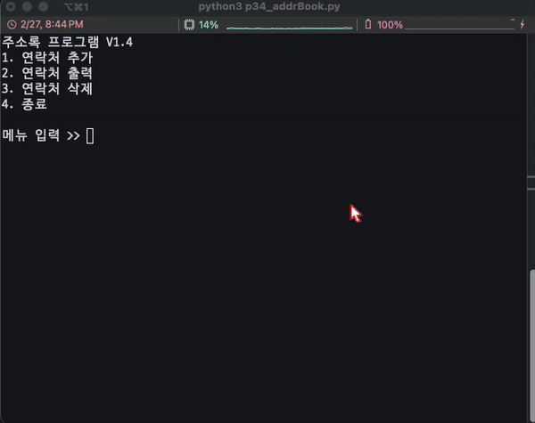

#### Windows App(PyQt 5)
- 윈도우 창 크기조절
- 윈도우 창 타이틀 설정
- 윈도우 창 위에 글자 그리기
  - 폰트 종류 및 크기, 색상 설정
- MacOS기준(작업표시줄 아이콘 변경)
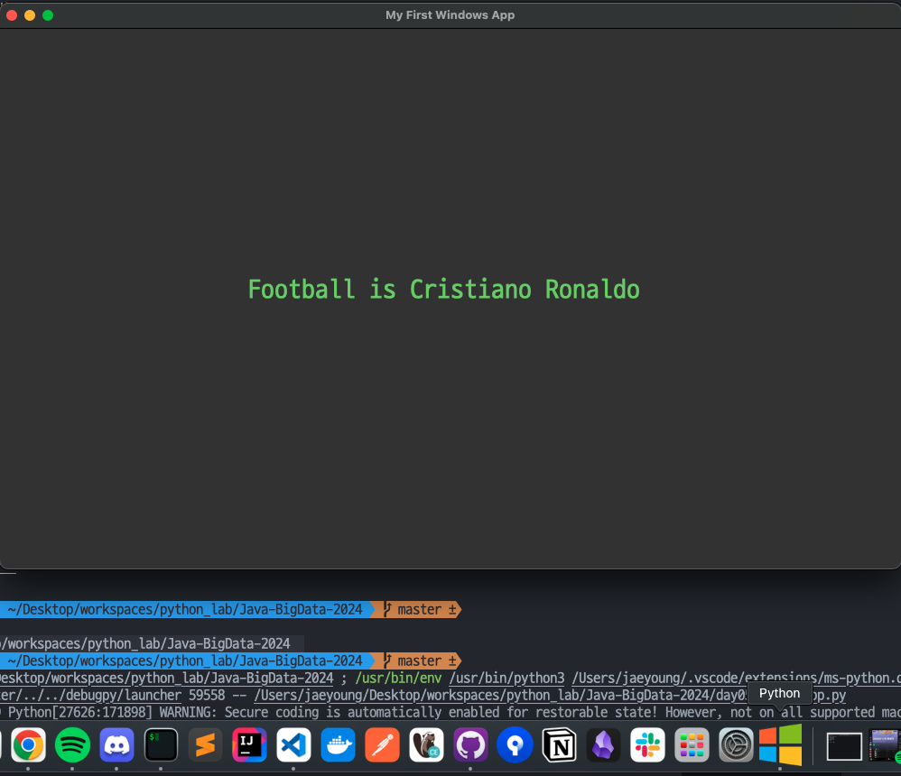

## 6일차
### Python 응용
> 1. PyQt5 : QWidget 자식 클래스 종류들
> 2. Qt Designer로 UI 만들기
> 3. Naver API 연동을 이용하여 네이버뉴스앱(진행중)
#### PyQt5 : QWidget 자식 클래스 종류들
- `QLabel` : 라벨을 사용하는 클래스
- `QVBoxLayout` : 레이아웃을 사용하는 클래스
- `addWidget()` : 레이아웃이나 라벨을 추가하는 함수
- `QPushButton` : 버튼을 추가하는 클래스
- 버튼을 클릭했을 때 동작하는 함수를 연결해주는 코드
  - `btn1.clicked.connect(self.btn1Clicked)`
- `btn1Clicked()` 함수를 호출하여 로직을 실행한다.
- `QMessageBox.about(self, caption, msg)` : 알림창을 띄운다.
#### PyQt5 자식클래스로 만든 윈도우 화면
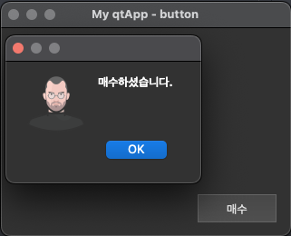
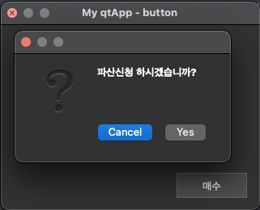

#### Qt Designer 를 이용한 윈도우 화면 만들기
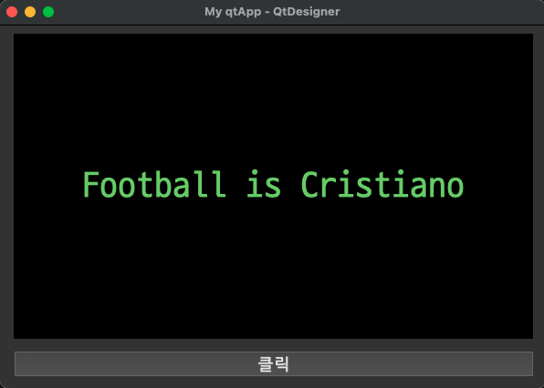
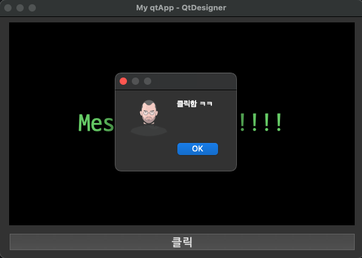
## 7일차
### Python 응용
> 1. PyQt5 : 네이버 뉴스 API 연동 앱 완성
> 2. JSON 학습
> 3. Thread 학습
> 4. TTS, QR Code 생성기 , 구글 번역기 앱
#### 네이버 뉴스 API 연동 앱
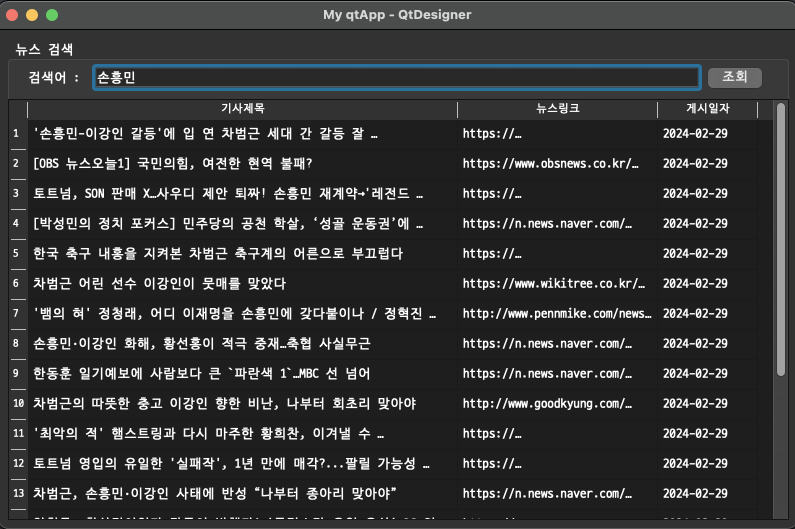
#### Thread 학습
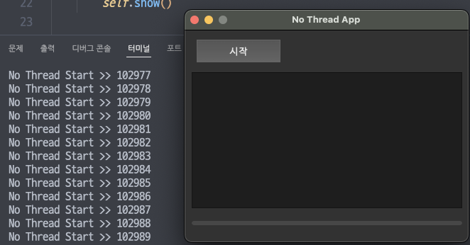
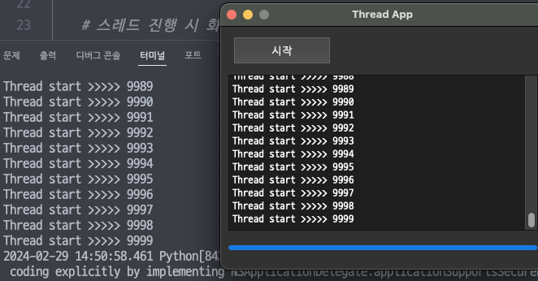
#### QR Code 생성기

#### 구글 번역기 앱
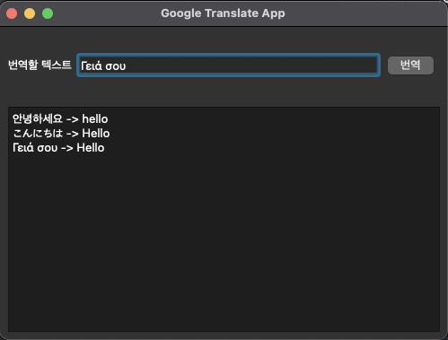

## 8일차
### Python 응용
> 1. 파이썬 자동화 : PyAutoGui 모듈사용해서 키보드,마우스, 스크린샷 조작하기
> 2. PyAutoGui 자동화로 네이버 날씨 캡쳐하기
> 3. Naver 중요알림 오면 Slack 에 메시지 전송

### Naver 중요알림 오면 Slack 에 메시지 전송
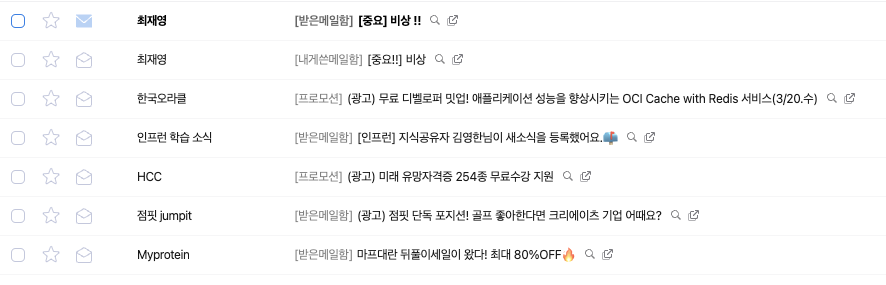

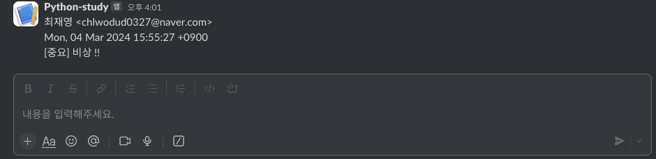